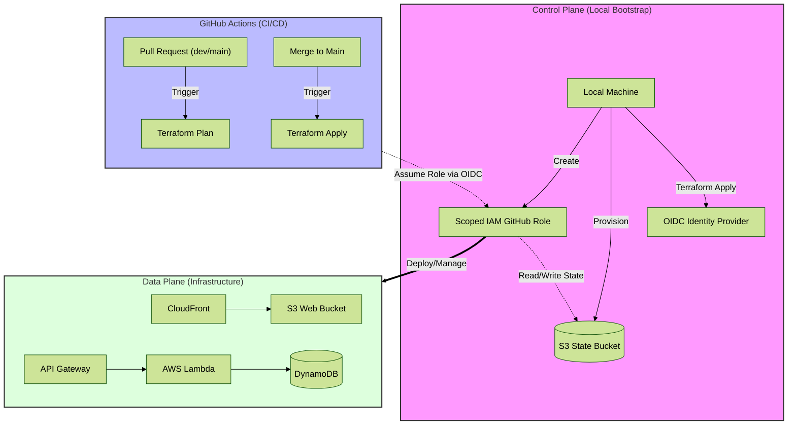

# Fully Automated Cloud Resume Challenge (AWS)
A serverless, high-availability resume website built with **Next.js**, deployed via **Terraform**, and fully automated through **GitHub Actions**.


## Project Overview
This project moves beyond a simple static site to build a professional-grade cloud infrastructure adhering to modern DevOps best practices**:
- **Infrastructure as Code (IaC)**: 100% of resources managed via Terraform.
- **Global Performance**: Content delivery through CloudFront with S3 **Origin Access Control (OAC)**.
- **Serverless Backend**: A visitor counter powered by Lambda and DynamoDB.
- **Security-First CI/CD**: 
    - Applied the **Principle of Least Privilege (PoLP)** to strictly limit IAM permissions.
    - Implemented Keyless Authentication between GitHub and AWS via **OIDC**.
- **Cost Conscious**: The entire project is architected to remain within the AWS **Free Tier**.


## The Architecture
The AWS infrastructure follows the design outlined in the diagram below:

[ARCHITECTURE IMAGE HERE]

- The **Frontend** utilizes a private S3 bucket as an origin. By using Origin Access Control (OAC), the bucket is shielded from direct public access, ensuring it can only be reached via the CloudFront endpoint. This setup leverages global edge caching to significantly reduce latency.

- The **Backend** is triggered by a frontend script that calls an API Gateway endpoint. This invokes an AWS Lambda function that updates and retrieves the visitor count from a DynamoDB table.


## Technical Decisions
The standard Cloud Resume Challenge involves manual configuration of several services. However, I chose to implement a robust pipeline to **eliminate almost all manual provisioning**.



#### The Challenge: 
I needed a way for GitHub Actions to reliably update the infrastructure without storing permanent AWS credentials in GitHub. Additionally, I had to solve the "State Sync" problem: if I ran Terraform locally and then GitHub ran it later, the two environments wouldn't know about each other's changes, leading to resource drift or accidental deletion.

To ensure the local environment and GitHub Actions remain in sync, I split the infrastructure into **two logical layers**:

### The Control Plane (Bootstrap)
A **one-time** manual deployment executed locally to establish the "Security Brain" of the project:
- **S3 Remote Backend**: Stores the ```terraform.tfstate``` file in the cloud so both the local machine and GitHub Actions share the same state.
- **IAM OIDC Provider**: Establishes a trust relationship between GitHub and AWS via OpenID Connect, eliminating the need for risky, long-lived ```AWS_ACCESS_KEY_ID``` secrets.
- **Scoped IAM Role**: A custom role granting GitHub Actions only the specific permissions required to manage the project resources.

### The Data Plane (Infrastructure)
By separating the "Body" of the infrastructure from the "Security Brain," I created a reliable environment for frequent updates without risking the core security setup. I implemented a Pull Request-based workflow to ensure every change is validated before deployment:
- **Validation Phase**: Every Pull Request to the ```main``` or ```develop``` branches triggers an automated ```terraform plan```. This allows for a "dry run" to verify exactly what resources will be added or changed before any action is taken.
- **Promotion Phase**: Once a PR is merged into the ```main``` branch, GitHub Actions executes a ```terraform apply```. This handles the automated deployment of:
    - **Frontend**: Next.js assets synced to the private S3 bucket.
    - **CDN**: CloudFront distribution updates and cache invalidations.
    - **API & Compute**: Deployment of the API Gateway and Python-based Lambda function.

#### This separation allows for frequent updates to the /infra directory (frontend/backend) while keeping the sensitive /bootstrap code stable and secure.


## Security Decisions
#### Keyless Authentication (OIDC)
- I intentionally avoided using IAM User Access Keys. By leveraging OpenID Connect (OIDC), GitHub Actions requests a short-lived, temporary token from AWS. This removes the risk of "Leaked Keys" and aligns with the **AWS Well-Architected Framework**.
```
# Setup OIDC Between AWS & Github
resource "aws_iam_openid_connect_provider" "github" {
  url            = "https://token.actions.githubusercontent.com"
  client_id_list = ["sts.amazonaws.com"]
}

# Github Action Policy Document
data "aws_iam_policy_document" "github_trust_policy" {
  statement {
    effect = "Allow"

    principals {
      type        = "Federated"
      identifiers = [aws_iam_openid_connect_provider.github.arn]
    }

    condition {
      test     = "StringEquals"
      variable = "token.actions.githubusercontent.com:aud"
      values   = ["sts.amazonaws.com"]
    }

    condition {
      test     = "StringLike"
      variable = "token.actions.githubusercontent.com:sub"
      values   = ["repo:heesooh/cloud_resume_challenge:*"]
    }

    actions = ["sts:AssumeRoleWithWebIdentity"]
  }
}
```

#### Principle of Least Privilege (PoLP)
- During the implementation, I encountered several "Access Denied" hurdles with API Gateway and CloudWatch tagging. Rather than granting ```AdministratorAccess``` to finish the project quickly, I spent time auditing the IAM Action paths to grant only the specific permissions (like ```apigateway:POST``` on ```/apis```) required for Terraform to manage the lifecycle of the resources.
```
data "aws_iam_policy_document" "github_permissions_policy" {
  # Grant Github Role Access to All Resrouces Deployed  
  statement {
    effect = "Allow"
    actions = [
      "dynamodb:*",
      "lambda:*",
      "apigateway:*",
      "cloudfront:*",
      "s3:*",
      "iam:*",
      "logs:*",
      "tag:TagResources",
      "tag:UntagResources"
    ]
    resources = [
      "arn:aws:s3:::${local.name_prefix}-*",
      "arn:aws:s3:::${local.name_prefix}-*/*",
      "arn:aws:lambda:*:*:function:${local.name_prefix}-*",
      "arn:aws:dynamodb:*:*:table/${local.name_prefix}-*",
      "arn:aws:iam::*:role/${local.name_prefix}-*",
      "arn:aws:logs:*:*:log-group:/aws/lambda/${local.name_prefix}-*",
      "arn:aws:cloudfront::${data.aws_caller_identity.current.account_id}:*",
      "arn:aws:apigateway:us-east-1::/tags/*",
      "arn:aws:apigateway:us-east-1::/tags",
      "arn:aws:apigateway:us-east-1::/apis/*",
      "arn:aws:apigateway:us-east-1::/apis"
    ]
  }

  # Grant Github Role Additional Access to Find CloudFornt Managed Caching Policy
  statement {
    effect = "Allow"
    actions = [
      "cloudfront:ListCachePolicies",
      "cloudfront:GetCachePolicy",
      "cloudfront:ListDistributions",
      "cloudfront:ListOriginAccessControls",
      "cloudfront:GetOriginAccessControl",
      "iam:ListPolicies",
      "iam:GetPolicy",
      "iam:GetRole",
      "apigateway:GET",
      "logs:DescribeLogGroups"
    ]
    resources = ["*"]
  }

  # Grant Github Role Access to Terraform State Bucket
  statement {
    effect = "Allow"
    actions = [
      "s3:ListBucket",
      "s3:GetObject",
      "s3:PutObject"
    ]
    resources = [
      "arn:aws:s3:::${aws_s3_bucket.terraform_state.bucket}",
      "arn:aws:s3:::${aws_s3_bucket.terraform_state.bucket}/*"
    ]
  }
}
```


#### Private Origin Access
- The S3 bucket is not public. **OAC** ensures that only my CloudFront distribution can fetch content, preventing users from scraping the bucket directly.

```
# Create CloudFront Distribution Origin Access Control
resource "aws_cloudfront_origin_access_control" "resume_bucket_oac" {
  name                              = "${local.name_prefix}-cloudfront-oac"
  origin_access_control_origin_type = "s3"
  signing_behavior                  = "always"
  signing_protocol                  = "sigv4"
}

# Create AWS Managed Cache Policy Object
data "aws_cloudfront_cache_policy" "optimized" {
  name = "Managed-CachingOptimized"
}

# Create CloudFront Distribution with OAC & Cache Policy Defined Above
resource "aws_cloudfront_distribution" "resume_distribution" {
  enabled             = true
  default_root_object = "index.html"

  origin {
    domain_name              = aws_s3_bucket.resume_bucket.bucket_regional_domain_name
    origin_id                = "cloud-resume-origin"
    origin_access_control_id = aws_cloudfront_origin_access_control.resume_bucket_oac.id
  }

  default_cache_behavior {
    target_origin_id       = "cloud-resume-origin"
    viewer_protocol_policy = "redirect-to-https"
    allowed_methods        = ["GET", "HEAD"]
    cached_methods         = ["GET", "HEAD"]

    cache_policy_id = data.aws_cloudfront_cache_policy.optimized.id
  }

  viewer_certificate {
    cloudfront_default_certificate = true
  }

  restrictions {
    geo_restriction {
      restriction_type = "none"
    }
  }

  custom_error_response {
    error_code         = 403
    response_code      = 200
    response_page_path = "/index.html"
  }
}
```


## Challenges & Lessons Learned
Transitioning from the AWS Console to Terraform revealed the "Console Magic" we often take for granted. In the console, AWS automatically attaches baseline permissions (like CloudWatch Logs for Lambda) and handles resource tagging behind the scenes.
- With IaC, **every implicit permission must be made explicit**. I learned that managing infrastructure means managing the lifecycle of the deployment role itself.
- I spent significant time auditing IAM Access Denied errors to realize that a deployment role doesn't just need permission to the resource ARN; it needs permission to hit the service collection endpoints (e.g., /apis and /tags) to actually provision and label those resources.

I discovered that Terraform is far more than just a "list of resources"; it is an intelligent state engine. Understanding its advanced features allowed me to move from hard-coded configurations to a dynamic, scalable setup.
- I successfully implemented a Remote S3 Backend, which allows Terraform to automatically sync state across different environments (Local vs. GitHub Actions) without manual intervention.
```
backend "s3" {
    bucket = "cloud-resume-challenge-tf-state-bucket-heesooh"
    key    = "terraform.tfstate"
    region = "us-east-1"
}
```

- Instead of manually uploading frontend assets, I utilized ```for_each``` with ```fileset``` and ```lookup``` functions to automate the deployment of the entire Next.js build directory. This ensures that every file—regardless of type—is uploaded with the correct MIME type and an MD5 hash (ETag) for change detection.
```
resource "aws_s3_object" "resume_objects" {
  for_each = fileset("${path.module}/../frontend/out", "**")

  bucket = aws_s3_bucket.resume_bucket.id
  key    = each.value
  source = "${path.module}/../frontend/out/${each.value}"
  content_type = lookup(
  local.content_types, element(split(".", each.value), length(split(".", each.value)) - 1), "text/plain")

  etag = filemd5("${path.module}/../frontend/out/${each.value}")
}
```


## How to Deploy
#### **Bootstrap**: 
- Run ```terraform apply``` in the ```./bootstrap``` directory to the **OIDC** role and the shared S3 **state bucket**. Terraform will output the **IAM Role ARN** on the terminal.

#### **Configure GitHub**: 
- Add the outputted Role ARN to your **GitHub Repository Secrets**.

#### **Deploy**: 
- Commit changes to the ```main``` or ```develop``` branch to trigger the automated pipeline.
    - **Pull requests** to the ```main``` and ```develop``` branches will trigger ```terraform plan``` to preview changes.
    - **Merge** to the ```main``` branch will trigger ```terraform apply``` to deploy updates to AWS.


## Tech Stack
- Cloud: AWS (S3, Lambda, DynamoDB, API Gateway, CloudFront, IAM)
- IaC: Terraform (v1.x)
- CI/CD: GitHub Actions
- Frontend: Next.js, HTML, CSS, Tailwind CSS, Javascript
- Language: Python (Backend), HCL (Infrastructure)
